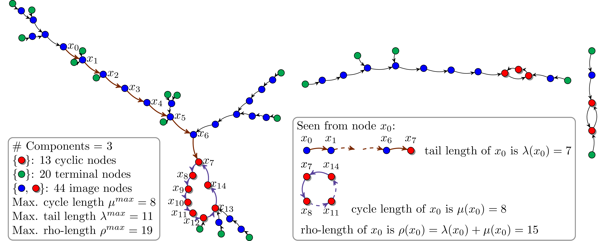
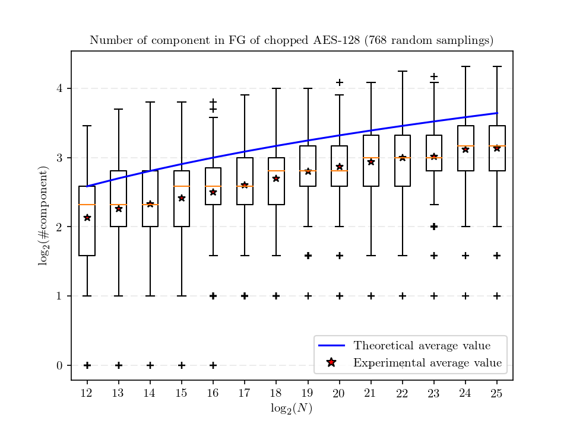
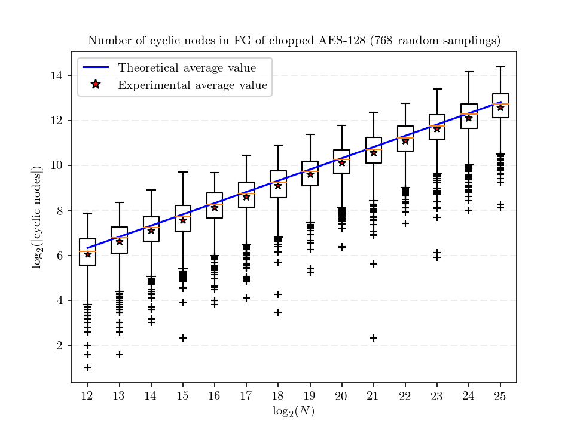
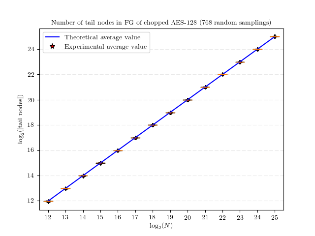
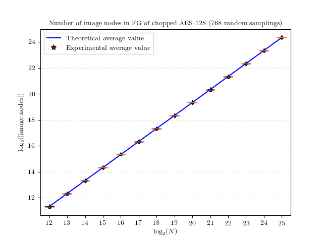
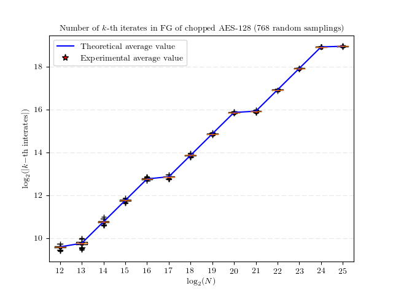

# Experiments on Statistical Properties of the Functional Graph of Random Mappings #

This program perform experimental verification on statistical properties of the functional graph of random mappings.

## Functional Graph of Random Mappings ##

The functional graph of *f* (a random mapping from *N*-set to itself) is a directed graph whose nodes are the elements *{0, ..., N-1}* and whose edges are the ordered pairs <*x, f(x)*>. It is constructed by successively iterated on *f*. Starting the development by taking an arbitrary node as input and taking the output as the input of next iteration on *f*, before *N* iterations, a value will equal to one of the previous evaluated node through which the iteration path enters a `cycle`. If we consider all possible starting nodes, `paths` exhibit confluence and form into `trees`; trees grafted on cycles form `components`; a collection of components forms a `functional graph` [\[FO90\]](https://link.springer.com/chapter/10.1007/3-540-46885-4_34).

The following figure is an illustration of the functional graph of a chopped AES-128 (obtained by fixing an arbitrary key and 122 bits of the input and take 6 bits as output, in this case *N = 64*).

The structure of the functional graph of random mappings has been studied for a long time.
Lots of parameters have got accurate asymptotic evaluation (refer to [\[FO90\]](https://link.springer.com/chapter/10.1007/3-540-46885-4_34) and [\[FS09\]](http://algo.inria.fr/flajolet/Publications/book.pdf)). These results on statistical properties of the random functional graph can provide various knowledge about the iteration of a random mapping, e.g., the expected number of iterations before one encounter a collision starting from a random node; a quantitative evaluation on the lost entropy of the output when iterating a random function many times. These results have stimulated fruitful results on the cryptanalysis of iterated hash constructions.

## Experimental Verification ##

A practical question is ``For real world pseudo-random mappings designed by cryptographers, how the properties of their functional graph diverse from those statistical properties of the functional graph of random mappings, which is deduced using approaches from analytic combinatorics?'' To answer this question, we performed experiments by simulating a few of *n*-bit random mappings with chopped AES-128 and SM4-128 (obtained by fixing an arbitrary key and *128-n* bits of the input and take *n* bits as the output, *n* is in {12, ..., 28}). For each *n < 26*, we sample hundreds of random mappings (for *n >= 26*, we can only sample several random mappings due to limited computing resource). We examined the average value, the maximum value, the minimum value and standard deviation respecting to the parameters considered in Theorem 2 in [\[FO90\]](https://link.springer.com/chapter/10.1007/3-540-46885-4_34), e.g., their number of cyclic nodes and their number of *k*-th iterates.

We directly use implementations of AES-128 and SM4-128 included in IPPCP (Cryptography for Intel Intergrated Performance Primitives) in IPP (Intel Integrated Performance Primitives). Thus, one may need to install [IPP](https://software.intel.com/en-us/intel-ipp) and [IPPCP](https://software.intel.com/en-us/get-ipp-cryptography-libraries) to compile and run this experiment.

- This program has been tested on the following platforms:
  + Windows 10 + VS 2015 + Intel C/C++ compiler 17.0
  + Red Hat Enterprise Linux Server release 6.9 + g++ (GCC) 5.1.0 + icpc (ICC) 18.0.0

- Compiling:
  + this is an paralleled implementation, and can be compiled using mpiicpc
  + four parameters can be defined manually during compiling:
     * `nmin`: the minimum value of *n* (default 12)
     * `nmax`: the maximum value of *n* (default 18)
     * `ns`: the number of samples for each *n*-bit random mapping (default 1024)
     * `nt`: the number of mpi processes (default 4)
  + example:
     * > make nmin=12 nmax=24 ns=768 nt=384

- Running example:
    > mpirun -np 384 ./FG

## Results ##

The following figures show summaries on the results (plotted using [matplotlib](https://matplotlib.org/)):

 

 

 

## References ##
[FO90] Philippe Flajolet and Andrew M. Odlyzko: Random Mapping Statistics. In Workshop on the Theory and Application of Cryptographic Techniques (EUROCRYPT’89), volume 434 of LNCS, pp. 329–354, Springer, Berlin, Heidelberg, 1990. https://link.springer.com/chapter/10.1007/3-540-46885-4_34

[FS09] Philippe Flajolet and Robert Sedgewick: Analytic Combinatorics. Cambridge University Press, 2009. http://algo.inria.fr/flajolet/Publications/book.pdf
